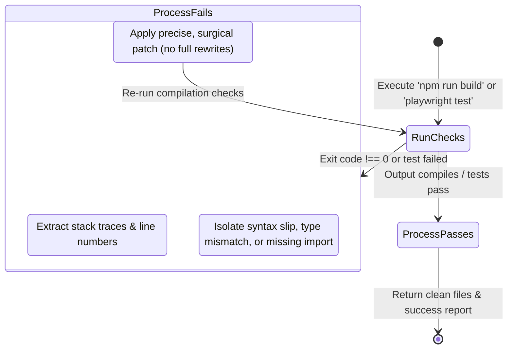

The coding agent is ZilMate's autonomous software engineer. It's not a snippet generator — it operates directly on your source tree inside a sandboxed loop: reading files, patching code, running install commands, executing build/test pipelines, and iterating on failures until everything passes.

## The three-tier engineering architecture

Instead of one general-purpose prompt writing and verifying code, `.coding()` orchestrates a structured team:

```mermaid
graph TD
    UserPrompt[User prompt to .coding()] --> Orchestrator[Coding Orchestrator]

    subgraph Execution Loop
        Orchestrator -->|Delegates UI/logic scaffold| AppBuilder[App Builder Specialist]
        AppBuilder -->|Saves code edits| Repo[Working Tree]

        Orchestrator -->|Delegates compilation & tests| QA[QA & Integration Specialist]
        QA -->|Runs compiler / test suites| Run[TypeScript / Playwright / Vitest]

        Run -->|Check failed| QA
        QA -->|Autonomous self-heal| Repo
    end

    Orchestrator -->|Final check & commit| Git[Git commit / PR]
```

### Specialist roles

1. **Coding Orchestrator (`createCodingAgent`)** — the lead architect and project manager. Inspects system context, pulls relevant framework skills (Next.js, Drizzle, Prisma), assigns tasks to subagents, and applies surgical Git commits.
2. **App Builder (`createAppBuilderAgent`)** — the implementation powerhouse. Scaffolds directories, configures database models, and constructs interfaces following premium visual guidelines.
3. **QA & Integration (`createQaIntegrationAgent`)** — the gatekeeper. Writes Playwright/Vitest tests, checks build compilation, isolates errors, and runs self-healing patch cycles.

---

## Programmatic execution

Call `.coding()` with a `{ prompt }` describing your requirements. It returns `{ text }` — a structured report of files changed, commands run, build status, and any remaining steps.

```ts
import { createZilMate } from 'zilmate/server';

const zilmate = createZilMate({ sessionId: 'billing-v2-migration' });

const { text } = await zilmate.coding({
  prompt: `
    In our Next.js repository:
    1. Scaffold a glassmorphic payment dashboard page at app/dashboard/billing/page.tsx.
    2. Define a ledger schema using Drizzle at src/db/schema.ts.
    3. Run 'npm run build' to ensure compilation is error-free.
    4. Report the exact files changed and the build logs.
  `,
});

console.log(text);
```

### Multi-step and iterative prompts

Chain multiple tasks in a single prompt when you want the agent to execute a sequence before reporting back — the coding orchestrator will plan the order, delegate to App Builder/QA, and only return once every step compiles.

---

## The autonomous self-healing dev loop

When a build, lint, or test fails, the QA & Integration agent enters an autonomous healing cycle. It does not escalate the failure back to you — it repairs the issue in place.



### How the loop works under the hood

- **Parse & isolate.** QA reads compiler streams, capturing exact line numbers, missing imports, and test failure reasons.
- **Formulate a fix.** It reasons about *why* the compilation broke (e.g. "we imported `Session` from the wrong auth library").
- **Surgical repair.** Instead of overwriting files, the agent uses pinpoint tools (`patchFile`, `applyUnifiedPatch`) to fix the exact character range.
- **Re-run & iterate.** It re-executes the check. If another failure appears, it repeats. It iterates until every check passes or safety step limits are reached.

<Note>
  You can gate destructive steps — installing packages, deleting files, running shell commands — with the `confirm` handler you pass to `createZilMate()`. See [Manager agent → Interactive approvals](/sdk/manager-agent#interactive-approvals-and-safe-execution).
</Note>

---

## Premium design & engineering standards

When App Builder scaffolds frontend code, its instructions enforce a high-end aesthetic and production-ready logic rather than boilerplate:

- **Harmonious color palettes.** Tailored HSL palettes (sleek dark modes, deep space blues, neon cyan highlights) instead of generic Tailwind defaults.
- **Glassmorphic layouts.** Semi-transparent borders, `backdrop-blur-md`, glowing gradients.
- **Responsive bento grids.** Modern grid columns for information cards.
- **Modern typography.** Dynamically imports Google Fonts (Inter, Outfit, Roboto) for headers and body.
- **Hover micro-animations.** Scale, glow, and transition effects on buttons, cards, and inputs.
- **No TODO placeholders.** Real, working logic — including functional mock schemas when a database is requested — never empty stubs.

---

## Wiki-aware coding (v1.10.3+)

The internal App Builder and QA subagents are equipped with [Corporate Wiki](/memory/corporate-wiki) tools (`queryCorporateWiki` and `publishToCorporateWiki`). Before scaffolding code, they fetch:

- Relational requirements published by the `architect` or `productManager`
- Third-party API schemas
- Monetization guides and billing contracts

After finishing, they publish net-new learnings back so the rest of the swarm stays aligned.

---

## Where to go next

<CardGroup cols={2}>
  <Card title="Subagents overview" icon="sitemap" href="/sdk/subagents">
    Call research, image, goal-planner, or copywriter directly without routing through the Manager.
  </Card>
  <Card title="Corporate Wiki" icon="book" href="/memory/corporate-wiki">
    How the semantic blackboard keeps App Builder and QA aligned with the rest of the swarm.
  </Card>
  <Card title="Safety firewall" icon="shield" href="/swarm/safety-firewall">
    How ZilMate intercepts shell and filesystem writes before they hit disk.
  </Card>
  <Card title="Model selection" icon="sliders" href="/sdk/model-selection">
    Route the coding agent to a stronger model while keeping help/chat on a fast one.
  </Card>
</CardGroup>
