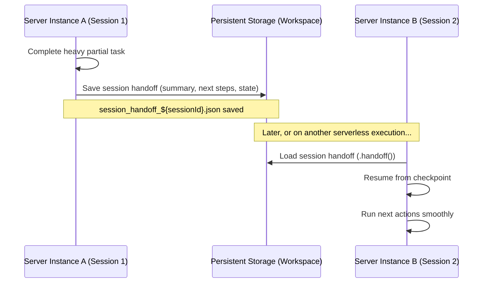

The Manager is ZilMate's CEO-level orchestrator. When you call `zilmate.manager()`, it surveys the tools and specialists it has, checks the live state of your workspace, and decides whether to act directly — searching the web, reading memory, running jobs, calling Docker — or delegate to a specialist like the coding agent, research agent, or a swarm department. The Manager never writes code itself; it coordinates, delegates, and synthesizes.

## `manager()` vs `chat()`

The SDK exposes two conversational entry points:

- **`manager()`** — full agentic orchestrator with access to every tool, subagent, memory, and situational brief. Use it for open-ended, multi-step tasks.
- **`chat()`** — lightweight, low-latency conversational agent. No tool loops, no filesystem writes. Use it for direct Q&A and greetings.

```ts
import { createZilMate } from 'zilmate/server';

const zilmate = createZilMate({ sessionId: 'user_prod_101' });

// Lightweight chat
const { text: hello } = await zilmate.chat({ message: 'Hello! Who are you?' });

// Multi-step orchestration
const { text: report } = await zilmate.manager({
  message: 'Analyze our local Docker container logs and compile a brief report.',
});
```

Both accept `{ message }` or `{ prompt }` interchangeably and return `{ text }` — the final synthesized response after every tool call and delegation is complete.

---

## Streaming progress with `onProgress`

Pass an `onProgress` handler to `createZilMate()` (or override it per call) to receive live events as the Manager thinks, calls tools, and delegates. This is what powers real-time chat UIs.

```ts
const zilmate = createZilMate({
  sessionId: 'user_prod_101',
  onProgress: (event) => {
    console.log(`[${event.type.toUpperCase()}] ${event.label}${event.detail ? ' — ' + event.detail : ''}`);
  },
});
```

Common `event.type` values you'll see: `thinking:start`, `tool:start`, `tool:end`, `search:start`, `subagent:start`, `subagent:end`, `handoff:save`.

---

## Situational awareness with `.situation()`

A key differentiator of the Manager is that it doesn't guess — it builds a high-fidelity brief of the host environment before touching anything. You can request the same brief directly:

```ts
const brief = await zilmate.situation({ sessionId: 'user_prod_101' });

console.log('Workspace CWD:', brief.cwd);
console.log('Active Git branch:', brief.git?.branch);
console.log('Uncommitted changes:', brief.git?.dirtyFilesCount);
console.log('DB schema version:', brief.databaseSchemaVersion);
console.log('Queued jobs:', brief.recentJobs?.length);
```

### How context injection flows

If you ask the Manager to "fix compilation errors," it internally:

1. Runs `.situation()` to inspect Git state, Node/package versions, and recent jobs.
2. Reads modified or untracked files.
3. Queries the [Corporate Wiki](/memory/corporate-wiki) for related contracts or ADRs.
4. Then plans and delegates — usually to the [Coding agent](/sdk/coding-agent).

You can also build a brief without an SDK instance:

```ts
import { buildSituationBrief } from 'zilmate/server';

const brief = await buildSituationBrief('user_prod_101');
```

---

## Session continuity and autonomous handoffs

Standard LLM sessions lose all context on restart. ZilMate mitigates this by saving structured handoff JSONs before the Manager finishes complex sequences — or when a workflow pauses to wait for an external webhook.



### Resuming with `.handoff()`

```ts
import { createZilMate } from 'zilmate/server';

const sessionId = 'durable_onboarding_task';
const zilmate = createZilMate({ sessionId });

const priorHandoff = await zilmate.handoff();

let taskPrompt = 'Walk me through setting up our main Stripe payment credentials.';

if (priorHandoff) {
  taskPrompt = `
    [RESUMING CONTEXT FROM CHECKPOINT]
    Prior summary: ${priorHandoff.summary}
    Completed: ${priorHandoff.completedActions.join(', ')}
    Pending: ${priorHandoff.nextActions.join(', ')}

    Proceed with: "${priorHandoff.nextActions[0]}"
  `;
}

const { text } = await zilmate.manager({ message: taskPrompt });
```

You can also load a handoff without an instance via `loadSessionHandoff(sessionId)` from `zilmate/server`.

---

## Interactive approvals and safe execution

In production, you often don't want agents running destructive mutations — deleting files, installing packages, dropping tables — without human sign-off. Pass a `confirm` handler and the Manager pauses restricted tool calls until it resolves.

```ts
import { createZilMate, type ConfirmationHandler } from 'zilmate/server';

const securityConfirm: ConfirmationHandler = async (request) => {
  console.log(`🛡️  [INTERCEPT] ${request.agentName} → ${request.toolName}`);
  console.log(`Rationale: ${request.message}`);
  console.log('Args:', JSON.stringify(request.args, null, 2));

  if (process.env.NODE_ENV === 'development') {
    return await promptUserInTerminal();
  }

  // In a hosted app:
  // 1. Save the request to a pending approvals table.
  // 2. Ping the client (WebSocket / Slack).
  // 3. Block until the user clicks approve/deny.
  const approvalId = await saveToApprovalsDatabase(request);
  return await pollForUserClick(approvalId);
};

const zilmate = createZilMate({
  sessionId: 'secure_sandbox_session',
  confirm: securityConfirm,
});
```

### `ConfirmationRequest` schema

| Property | Type | Description |
|---|---|---|
| `id` | `string` | Unique identifier for this confirmation transaction. |
| `agentName` | `string` | The requesting agent (e.g. `App Builder`, `QA Integration`). |
| `toolName` | `string` | The exact tool being requested (e.g. `deleteFile`, `runCommand`). |
| `message` | `string` | The agent's plain-English rationale for the action. |
| `args` | `Record<string, any>` | The raw parameter arguments the tool will receive. |

Return `true` to run the tool, `false` to block it (the Manager receives an error and re-plans). Cached approval decisions for the current session can be cleared with `clearSessionApprovals()`.

---

## Where to go next

<CardGroup cols={2}>
  <Card title="Coding agent" icon="code" href="/sdk/coding-agent">
    Delegate repo edits, builds, and tests to the App Builder + QA subagents.
  </Card>
  <Card title="Subagents" icon="sitemap" href="/sdk/subagents">
    Skip the Manager and call research, image, goal-planner, or copywriter directly.
  </Card>
  <Card title="Session continuity" icon="rotate" href="/memory/session-continuity">
    Deep dive on how handoffs and the situation brief work end-to-end.
  </Card>
  <Card title="Safety firewall" icon="shield" href="/swarm/safety-firewall">
    How ZilMate intercepts shell commands and filesystem writes before they run.
  </Card>
</CardGroup>
