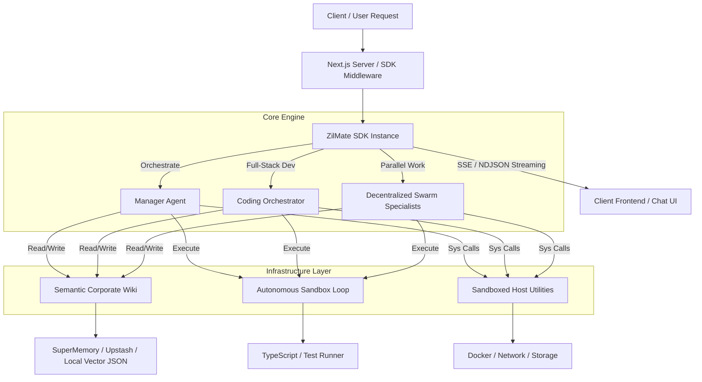

The ZilMate SDK is an enterprise-grade agentic runtime for Node.js and Next.js. It embeds autonomous agents, a decentralized swarm, semantic memory, durable job scheduling, real-time voice, and sandboxed host utilities behind a single factory function: `createZilMate()`, imported from `zilmate/server`.

```bash
npm install zilmate
```

## Architecture at a glance



## Core capabilities

| Capability | Entry point | What it does |
|---|---|---|
| Manager Orchestrator | `zilmate.manager()` | Routes intent, pulls situation briefs, coordinates sub-threads. |
| Full-Stack Coding Suite | `zilmate.coding()` | App Builder + QA subagents in a self-healing compile/test loop. |
| Decentralized Swarm | `createSwarmSpecialist()` | 30+ specialists across 6 departments, peer-to-peer Joint War Rooms. |
| Semantic Corporate Wiki | `zilmate.publishToWiki()` / `zilmate.queryWiki()` | Shared blackboard for schemas, ADRs, and cross-agent context. |
| Long-term Memory | `zilmate.remember()` / `zilmate.recall()` | Session-scoped episodic memory with vector search. |
| Durable Jobs | `zilmate.createJob()` / `zilmate.handleJobWebhook()` | Cron-based scheduling + Upstash QStash webhooks. |
| Voice & STT | `zilmate.startVoiceSession()` | Real-time voice loop powered by Deepgram. |
| Host Utilities | Docker, network, storage, FFmpeg | Sandboxed system tools available to every agent. |

---

## Environment variables

Only `AI_GATEWAY_API_KEY` is required. Every other variable unlocks an optional capability.

```env
AI_GATEWAY_API_KEY=your-gateway-key
ZILMATE_USER_ID=zilmate-admin-id
```

| Variable | Category | Feature unlocked |
|---|---|---|
| `AI_GATEWAY_API_KEY` | Required | Gateway access to Claude, GPT-4, and specialist LLMs. |
| `ZILMATE_USER_ID` | Optional | Session isolation and persistent user profiling. |
| `ZILMATE_WORKSPACE` | Optional | Root folder for notebooks, memory, model selections, and job logs (defaults to `~/Downloads/ZilMate`). |
| `COMPOSIO_API_KEY` | Optional | GitHub, HubSpot, Linear, Notion, Slack, Stripe integrations. |
| `TAVILY_API_KEY` | Optional | Multi-source deep-web research inside the Research agent. |
| `DEEPGRAM_API_KEY` | Optional | Real-time voice loops (mic + TTS). |
| `UPSTASH_REDIS_REST_URL` / `..._TOKEN` | Optional | Multi-instance durable memory, job queues, distributed locking. |
| `CORPORATE_WIKI_PROVIDER` | Optional | Selects vector backend: `supermemory` \| `upstash` (defaults to local). |
| `SUPERMEMORY_API_KEY` | Optional | Central SuperMemory index for the Corporate Wiki. |
| `UPSTASH_VECTOR_REST_URL` / `..._TOKEN` | Optional | Upstash Vector backend for the Corporate Wiki. |
| `AWS_ACCESS_KEY_ID` / `AWS_SECRET_ACCESS_KEY` / `AWS_DEFAULT_REGION` | Optional | S3 uploads for backups and reports. |
| `GOOGLE_APPLICATION_CREDENTIALS` | Optional | GCS uploads as a cloud-storage fallback. |
| `BLOB_READ_WRITE_TOKEN` | Optional | Vercel Blob storage. |

---

## `createZilMate()` options

`createZilMate(options?)` accepts a single options object and returns a bound instance whose methods are all scoped to your session.

<ParamField body="sessionId" type="string" optional>
  Isolates memory, jobs, handoffs, and context per user or workspace. Defaults to `'default'`. Pass a stable identifier — such as a user ID or workspace slug — to keep each user's data separate.
</ParamField>

<ParamField body="onProgress" type="(event: ProgressEvent) => void" optional>
  Receives live progress events as agents work. Each event carries a `type` (e.g. `tool:start`, `tool:end`, `search:start`) and a human-readable `label`. Use this to stream status updates over SSE/NDJSON to a UI or write structured logs.
</ParamField>

<ParamField body="confirm" type="ConfirmationHandler" optional>
  Approval callback invoked before any destructive operation (file writes, shell commands, DB mutations). Receives a `ConfirmationRequest` with `agentName`, `toolName`, `message`, and `args`. Return `true` to proceed or `false` to abort.
</ParamField>

### Basic initialization

```ts
import { createZilMate } from 'zilmate/server';
import type { ConfirmationHandler } from 'zilmate/server';

const confirm: ConfirmationHandler = async (request) => {
  console.log(`🛡️  ${request.agentName} wants to run ${request.toolName}: ${request.message}`);
  return true; // approve
};

const zilmate = createZilMate({
  sessionId: 'dashboard-user-123',
  onProgress: (event) => console.log(`[${event.type}]`, event.label),
  confirm,
});

const { text } = await zilmate.manager({
  message: 'Summarize my open jobs and suggest next steps.',
});
console.log(text);
```

---

## Method reference

Everything returned by `createZilMate()` is a `Promise`-returning method scoped to your session.

### Agent methods

| Method | Description |
|---|---|
| `chat(input: ZilMateTextInput)` | Lightweight conversational agent. No tool loops. |
| `manager(input: ZilMateTextInput \| ZilMatePromptInput)` | CEO-level orchestrator — full tool access, delegation, and situation awareness. |
| `help(input: ZilMateQuestionInput \| ZilMateTextInput)` | Fast quick-help for usage and troubleshooting. |
| `guide(input: ZilMateTextInput)` | Conversational walkthrough via the chat agent. |
| `post(input: ZilMatePromptInput)` | Copywriter for social posts, status updates, announcements. |
| `research(input: ZilMateResearchInput \| ZilMateTextInput)` | Docs and web research, returns sourced answers with citations. |
| `coding(input: ZilMatePromptInput)` | Coding agent with App Builder + QA subagents and a self-healing loop. |
| `imageAgent(input: ZilMatePromptInput)` | Image director — refines the prompt via `enhanceImagePrompt`, then generates. |
| `goalManager(input: ZilMatePromptInput)` | Breaks high-level goals into ordered, schedulable steps. |

### Situational awareness and continuity

| Method | Description |
|---|---|
| `situation(input?)` | Returns `{ cwd, git, recentJobs, models, databaseSchemaVersion, memory, workspace }`. Called internally before complex tasks. |
| `handoff(input?)` | Loads a saved session handoff: `{ summary, completedActions, nextActions }`. Returns `null` if none exists. Use it to resume interrupted work. |

### Corporate Wiki + memory

| Method | Description |
|---|---|
| `remember({ text, tags? })` | Persist a text entry to long-term episodic memory. |
| `recall({ query?, limit? })` | Semantic search across stored memories (default `limit: 8`). |
| `listMemories()` / `forget(id)` / `clearMemories()` | Enumerate and delete memory entries. |
| `publishToWiki({ title, content, tags? })` | Publish a semantic document to the Corporate Wiki blackboard. |
| `queryWiki({ query, limit? })` | Semantic search over the Corporate Wiki. |

### Jobs

| Method | Description |
|---|---|
| `createJob(input)` | Creates a durable job; registers a QStash schedule when cron config is present. |
| `listJobs(options?)` / `getJob(id)` / `getJobLogs(id)` | Enumerate and inspect jobs. |
| `runJob(id)` / `runDueJobs()` | Trigger a job immediately or scan for due jobs. |
| `cancelJob(id)` | Cancel a scheduled or running job. |
| `handleJobWebhook(payload, expectedSecret?)` | Verify and execute a QStash-triggered job payload. |

### Voice

| Method | Description |
|---|---|
| `startVoiceSession(input?)` | Opens a Deepgram voice agent session. Inherits `onProgress` unless overridden. |
| `getVoiceConfig()` | Returns the active voice config (`listenModel`, provider settings). |

---

## Standalone exports

Some functions don't require an instance. Import them directly:

```ts
import {
  chat,
  help,
  post,
  research,
  image,
  applyStoredModelSelections,
  saveModelSelection,
  buildSituationBrief,
  loadSessionHandoff,
  clearSessionApprovals,
} from 'zilmate/server';
```

| Export | Description |
|---|---|
| `chat / help / post / research(input, options?)` | Stateless one-shot agent calls. |
| `image(input)` | One-shot image generation call. |
| `applyStoredModelSelections()` | Load persisted overrides from `models.json` and apply them to the process env. Call once at startup. |
| `saveModelSelection(agentKey, modelId)` | Persist a model override for an agent role. |
| `buildSituationBrief(sessionId)` | Build a situation brief without an instance. |
| `loadSessionHandoff(sessionId)` | Load a saved handoff by session ID. |
| `clearSessionApprovals()` | Clear cached approval decisions for the session. |

---

## Streaming to the client (Next.js App Router)

Stream progress events and the final answer over NDJSON. Set the Node.js runtime — ZilMate uses filesystem, child processes, and native modules.

```ts app/api/zilmate/route.ts
import { createZilMate } from 'zilmate/server';

export const runtime = 'nodejs';
export const maxDuration = 300;

export async function POST(request: Request) {
  const { message, sessionId = 'web_default_session' } = await request.json();
  const encoder = new TextEncoder();

  const stream = new ReadableStream({
    async start(controller) {
      const send = (payload: unknown) => {
        controller.enqueue(encoder.encode(`${JSON.stringify(payload)}\n`));
      };

      const zilmate = createZilMate({
        sessionId,
        onProgress: (event) => send({ type: 'progress', event }),
        confirm: async (req) => {
          send({ type: 'confirmation_required', request: req });
          return true;
        },
      });

      try {
        const { text } = await zilmate.manager({ message });
        send({ type: 'done', text });
      } catch (error) {
        send({ type: 'error', message: (error as Error).message });
      } finally {
        controller.close();
      }
    },
  });

  return new Response(stream, {
    headers: {
      'Content-Type': 'application/x-ndjson',
      'Cache-Control': 'no-cache, no-transform',
      'Connection': 'keep-alive',
    },
  });
}
```

---

## Production tips

<Tip>
  Set `ZILMATE_WORKSPACE` to a durable directory in production. It controls where notebooks, long-term memory, model selections, and job logs are stored. Without it, ZilMate defaults to `~/Downloads/ZilMate`.
</Tip>

<Tip>
  Keep `AI_GATEWAY_API_KEY` server-side only. All `zilmate/server` imports are Node.js-only and won't bundle into client code when used inside `app/api/` routes or server components.
</Tip>

<Note>
  Call `applyStoredModelSelections()` once at startup in long-lived processes (workers, queue consumers) so persisted overrides via `saveModelSelection()` are active before the first agent call.
</Note>

<Note>
  Enable Upstash Redis in multi-instance deployments so memory, job state, and locks are shared across all server instances instead of living in local files.
</Note>
