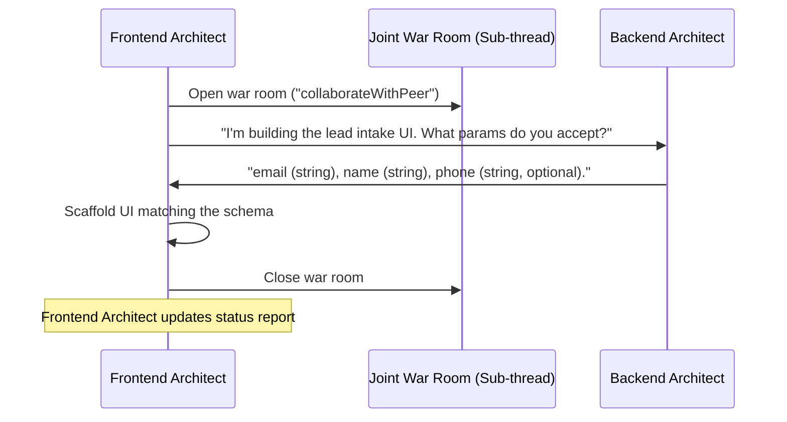

When you know exactly which specialist you need, call it directly instead of routing through the Manager. Direct calls skip orchestration overhead — no routing logic, no delegation step — and return faster for focused, well-defined tasks. The Manager only adds value when the task spans multiple domains.

## SDK subagent method reference

Every subagent hangs off the same `createZilMate()` instance, so they share your `sessionId`, `onProgress`, and `confirm` handlers.

| Method | Agent | Input type | Best for |
|---|---|---|---|
| `manager({ message })` | Main orchestrator | `ZilMateTextInput` | General tasks, routing, tools, memory |
| `chat({ message })` | Conversational chat | `ZilMateTextInput` | Open-ended dialogue with no tool loops |
| `coding({ prompt })` | Coding agent | `ZilMatePromptInput` | Repo edits, builds, tests, patches |
| `imageAgent({ prompt })` | Image director | `ZilMatePromptInput` | Image generation and prompt refinement |
| `goalManager({ prompt })` | Goal planner | `ZilMatePromptInput` | Break high-level goals into ordered steps |
| `research({ query })` | Docs/web research | `ZilMateResearchInput` | Sourced answers with citations |
| `help({ question })` | Quick help | `ZilMateQuestionInput` | Usage questions and troubleshooting |
| `post({ prompt })` | Copywriter | `ZilMatePromptInput` | Short social posts and status updates |
| `guide({ message })` | Walkthrough guide | `ZilMateTextInput` | Step-by-step explanations |

### Input type variants

ZilMate uses distinct input shapes so each agent's interface is explicit:

```ts
type ZilMateTextInput = { message: string };
type ZilMatePromptInput = { prompt: string };
type ZilMateQuestionInput = { question: string };
type ZilMateResearchInput = { query: string; sources?: number };
```

All agent methods return `Promise<{ text: string }>`.

### Example: focused research call

```ts
import { createZilMate } from 'zilmate/server';

const zilmate = createZilMate({ sessionId: 'weekly-brief' });

const { text } = await zilmate.research({
  query: 'What are the newest changes in Next.js 15 App Router streaming?',
});

console.log(text);
```

### Example: goal-planner + coding pipeline

Chain specialists explicitly when you want direct control over the flow:

```ts
const plan = await zilmate.goalManager({
  prompt: 'Ship a landing page with waitlist signup and Stripe test-mode checkout.',
});

const build = await zilmate.coding({
  prompt: `Follow this plan and implement it end-to-end:\n${plan.text}`,
});

console.log(build.text);
```

---

## The Decentralized Swarm

Alongside the SDK's built-in subagents, ZilMate ships a **Decentralized Swarm** — **30+ specialists** organized into **6 core departments**. Each has custom system instructions, focused skills, and a curated toolkit.

### Departments & specialists

| Department | Specialist | Primary domain |
|---|---|---|
| **Strategy & Product** | `productManager` | Roadmap and issue specs (GitHub, Linear) |
|  | `marketAnalyst` | Competitive research (Twitter, Reddit, Firecrawl) |
|  | `uxResearcher` | UX audits and browser-session analysis |
| **Engineering & Design** | `architect` | ADR design and interface contracts |
|  | `fullStackCoder` | Code implementation (Git, VS Code, Drizzle) |
|  | `qaEngineer` | Test suites and dev loops (Playwright, Vitest) |
|  | `devopsSre` | Cloud and Docker (Render, AWS, Vercel) |
|  | `creativeDirector` | Graphic assets and prompt design |
|  | `securityAuditor` | Penetration, dependency, and sandbox reviews |
| **Development Specialists** | `frontendArchitect` | UI foundations, styling systems, Tailwind v4 |
|  | `backendArchitect` | API routes, middleware, edge limits, auth |
|  | `dbSpecialist` | Schemas and migrations (Postgres, Drizzle, Neon) |
|  | `salesOps` | CRM syncing (HubSpot, Salesforce, Notion) |
| **Growth & Marketing** | `growthHacker` | Funnel CRO and Stripe metrics |
|  | `seoExpert` | On-page and AI-search SEO |
|  | `contentWriter` | Articles, docs, copywriting |
| **Operations & Legal** | `financeAnalyst` | Ledger syncs and tax exports |
|  | `customerSuccess` | Feedback routing and ticket automation |
|  | `legalCounsel` | Privacy audits and terms drafts |
| **Data & Automation** | `agentOptimizer` | Prompt/memory tuning, learning harvester |

### Joint War Rooms (`collaborateWithPeer`)

Swarm specialists don't wait on a central router. When the `frontendArchitect` needs to build a form, they open a **Joint War Room** with the `backendArchitect` directly to negotiate the JSON schema:



`collaborateWithPeer` instantiates the requested specialist, sets up a shared conversation loop, runs the collaborative task, and returns the unified result to the caller.

### Calling a swarm specialist programmatically

You can bypass the Manager and target a single specialist:

```ts
import { createSwarmSpecialist } from 'zilmate/server';

async function runSeoAudit() {
  const seoAgent = createSwarmSpecialist('seoExpert');
  await seoAgent.init('seo_landing_page_session');

  const report = await seoAgent.run(`
    Verify SEO health of our homepage and write a metadata recommendation report.
    Ensure the page adheres to our "ai-seo" guidelines so ChatGPT and Perplexity can cite us.
  `);

  console.log(report);
}
```

---

## Swarm observability

Nested multi-agent runs can be hard to debug. ZilMate ships a full trace tracker that logs every agent switch, tool call, and Joint War Room sub-thread.

```ts
import { loadSessionSpans, renderTraceTree, generateHtmlDashboard } from 'zilmate/server';
import { writeFile } from 'node:fs/promises';
import path from 'node:path';

async function exportSwarmTrace(sessionId: string) {
  const spans = await loadSessionSpans(sessionId);

  // ASCII tree in the terminal
  console.log(renderTraceTree(spans));

  // Glassmorphic HTML dashboard
  const html = generateHtmlDashboard(spans, sessionId);
  const outputPath = path.join(process.cwd(), `logs/dashboard-${sessionId}.html`);
  await writeFile(outputPath, html, 'utf8');

  console.log(`Dashboard: ${outputPath}`);
}
```

The HTML dashboard includes collapsible directory-tree nodes with query-based auto-expand, clickable KPI cards that filter traces in place, a chronological Gantt timeline, and one-click Copy JSON on every inspector panel.

---

## Where to go next

<CardGroup cols={2}>
  <Card title="Swarm overview" icon="sitemap" href="/swarm/overview">
    Full architecture of the Digital Corporation and how peer-to-peer coordination works.
  </Card>
  <Card title="Joint war rooms" icon="users" href="/swarm/joint-war-rooms">
    Deep dive on `collaborateWithPeer` and the shared context bus.
  </Card>
  <Card title="Model selection" icon="sliders" href="/sdk/model-selection">
    Assign different models to different specialists.
  </Card>
  <Card title="Corporate Wiki" icon="book" href="/memory/corporate-wiki">
    How swarm specialists publish and query shared contracts.
  </Card>
</CardGroup>
